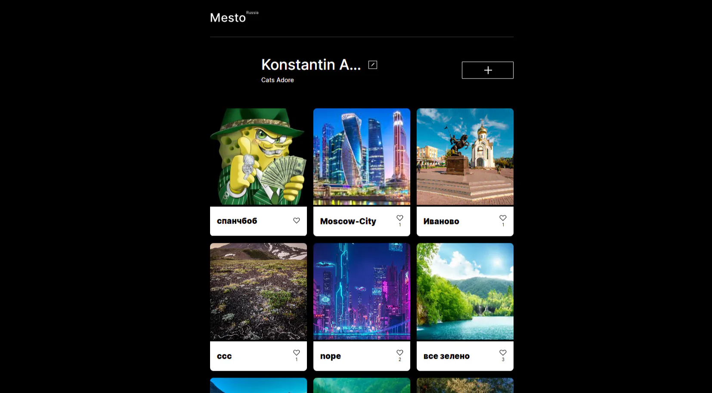

# 🏛️ Проект Место

<div align="center">


</div>

### Превью проекта



### Интерфейс сайта

[🔗 Посмотреть демо](https://annenkov-konstantin.github.io/mesto-project-ff/) • [💻 Исходный код](https://github.com/Annenkov-Konstantin/mesto-project-ff)

Интерактивное SPA на чистом JavaScript с интеграцией REST API и кастомной валидацией форм. Сайт позволяет добавлять карточки с фотографиями мест, ставить лайки, редактировать профиль и загружать аватар. Все данные синхронизируются с сервером через API.

## 📄 Функциональность

- **Профиль пользователя** — отображение имени, описания и аватара с возможностью редактирования
- **Карточки мест** — добавление новых карточек с названием и ссылкой на изображение
- **Лайки** — возможность ставить и снимать лайки с карточек (включая свои)
- **Удаление карточек** — удаление собственных карточек с подтверждением через модальное окно
- **Просмотр изображений** — открытие полноразмерного фото в модальном окне по клику
- **Редактирование профиля** — изменение имени и описания через модальное окно
- **Смена аватара** — загрузка нового аватара по ссылке
- **Кастомная валидация** — проверка всех форм с отображением ошибок в реальном времени
- **Модальные окна** — единая система модальных окон через `<template>` с анимацией открытия/закрытия

## 🛠 Стек технологий

- **Вёрстка:** HTML5, CSS3 (БЭМ-методология)
- **JavaScript:** Vanilla JS (ES6+) — модульная архитектура
- **Сборка:** Webpack (Babel, PostCSS, HTML/CSS loaders)
- **API:** REST API (Promise, async/await)
- **Методология:** БЭМ (Блок-Элемент-Модификатор) с файловой структурой
- **Оптимизация:** Минификация CSS/JS, оптимизация изображений

## ✨ Ключевые особенности

### 🎨 Интерфейс

- **БЭМ-методология** — строгая структура CSS с разделением на блоки, элементы и модификаторы
- **Модульная архитектура** — код разделён на независимые модули (api, card, modal, validation)
- **Template-based рендеринг** — карточки создаются через `<template>` для переиспользования
- **Анимации** — плавное открытие/закрытие модальных окон через CSS-классы
- **Адаптивная вёрстка** — три брейкпоинта (320px, 768px, 1024px)

### ⚡ Производительность

- **Webpack** — автоматическая сборка, минификация и оптимизация
- **Lazy loading** — изображения загружаются по мере необходимости
- **Модульный CSS** — каждый блок имеет свой файл, что упрощает поддержку
- **Оптимизация изображений** — автоматическое сжатие через Webpack

### ♿ Доступность (a11y)

- **Семантическая вёрстка** — `<header>`, `<main>`, `<footer>`, `<section>`
- **Клавиатурная навигация** — закрытие модальных окон по Escape
- **ARIA-атрибуты** — корректная разметка для скринридеров
- **Focus management** — управление фокусом при открытии/закрытии модалок

### 🔒 Валидация форм

- **Кастомная валидация** — собственная система проверки полей без сторонних библиотек
- **Валидация в реальном времени** — ошибки отображаются сразу при вводе
- **Regex-паттерны** — проверка формата введённых данных (только буквы, дефисы, пробелы)
- **Кастомные сообщения об ошибках** — через атрибут `data-error-message`
- **Блокировка отправки** — кнопка submit неактивна, пока есть ошибки
- **Подстановка значений** — автоматическое заполнение полей текущими данными профиля

### 🌐 Интеграция с API

- **REST API** — все операции с карточками и профилем через HTTP-запросы
- **Promise-based** — использование Promise и async/await для асинхронных операций
- **Обработка ошибок** — корректная обработка сетевых ошибок и ответов сервера
- **Оптимистичный UI** — интерфейс обновляется до получения ответа от сервера


### ⚙️ Конфигурация API

Конфигурация API (базовый URL и токен авторизации) вынесена в переменные окружения через `.env` файл. Это позволяет:
- Не коммитить секретные данные в репозиторий
- Легко переключаться между окружениями (dev/staging/prod)
- Следовать принципам 12-factor app


## 🚀 Запуск

### Самый простой способ

Просто откройте `dist/index.html` в любом современном браузере (двойной клик по файлу).


### Подготовка окружения через Live Server (VS Code)

1. Клонируйте репозиторий:

```bash
git clone https://github.com/Annenkov-Konstantin/mesto-project-ff.git
cd mesto-project-ff
```

2. Установите зависимости:

```bash
# Установка зависимостей
npm install
```

3. Создайте файл .env на основе шаблона:

```bash
cp .env.example .env
```

4. Получите токен авторизации для API Mesto и укажите его в .env:

```bash
API_BASE_URL=https://mesto.nomoreparties.co/v1/wff-cohort-37
API_AUTH_TOKEN=ваш_токен_авторизации
```

💡 Токен авторизации для работы с API можно получить в документации сервиса Mesto либо найти в истории коммитов 🙂.

5. Запустите dev-сервер:

```bash
# Запуск dev-сервера (с горячей перезагрузкой)
npm run dev
```

6. Сборка для продакшена

```
npm run build
```

7. Деплой на GitHub Pages

```
npm run deploy
```


## 📁 Структура проекта (src/)

```
mesto-project-ff/
├── index.html                    # Главная страница
├── blocks/                       # БЭМ-блоки
│   ├── card/                     # Карточка места
│   │   ├── __delete-button/
│   │   ├── __description/
│   │   ├── __image/
│   │   ├── __like-button/
│   │   │   └── _is-active/       # Модификатор активной кнопки лайка
│   │   ├── __likes-container/
│   │   ├── __likes-quantity/
│   │   ├── __title/
│   │   └── card.css
│   ├── content/
│   ├── footer/
│   ├── header/
│   ├── page/
│   ├── places/
│   ├── popup/                    # Модальные окна
│   │   ├── __button/
│   │   ├── __close/
│   │   ├── __content/
│   │   ├── __form/
│   │   ├── __input/
│   │   ├── __title/
│   │   ├── _is-animated/         # Модификатор анимации
│   │   ├── _is-opened/           # Модификатор открытого состояния
│   │   └── popup.css
│   └── profile/                  # Профиль пользователя
├── images/                       # Изображения
├── pages/
│   └── index.css                 # Точка входа CSS
├── scripts/                      # JavaScript модули
│   ├── api.js                    # Работа с REST API
│   ├── card.js                   # Создание и управление карточками
│   ├── index.js                  # Точка входа JS
│   ├── modal.js                  # Управление модальными окнами
│   └── validation.js             # Кастомная валидация форм
├── vendor/                       # Сторонние библиотеки
│   ├── fonts/                    # Шрифты Inter
│   ├── fonts.css
│   └── normalize.css
└── README.md
```

## 🧠 Архитектурные решения

### Модульная структура

Код разделён на независимые модули, каждый из которых отвечает за свою область:

- **`api.js`** — инкапсулирует все HTTP-запросы к серверу
- **`card.js`** — создание DOM-элементов карточек из template
- **`modal.js`** — универсальное управление открытием/закрытием модалок
- **`validation.js`** — переиспользуемая система валидации форм
- **`index.js`** — точка входа, инициализация и связывание модулей

### REST API

Все операции с данными выполняются через REST API:

```javascript
// Получение карточек
GET /cards

// Создание карточки
POST /cards { name, link }

// Удаление карточки
DELETE /cards/:id

// Лайк карточки
PUT /cards/:id/likes

// Удаление лайка
DELETE /cards/:id/likes

// Получение профиля
GET /users/me

// Обновление профиля
PATCH /users/me { name, about }

// Обновление аватара
PATCH /users/me/avatar { avatar }
```

### 🔒 Безопасность и конфигурация

- **Переменные окружения** — токен авторизации и базовый URL API вынесены в `.env` файл в соответствии с best practices (12-factor app)
- **`.env.example`** — шаблон конфигурации для других разработчиков
- **`.gitignore`** — секретные данные не попадают в репозиторий
- **Webpack DefinePlugin** — переменные окружения инжектятся в бандл на этапе сборки

### Кастомная валидация

Система валидации реализована как переиспользуемый класс:

- **Валидация каждого поля** — проверка на обязательность, длину, формат
- **Валидация формы** — проверка всех полей перед отправкой
- **Отображение ошибок** — добавление CSS-классов и текста ошибок
- **Блокировка кнопки** — деактивация submit при наличии ошибок
- **Сброс валидации** — очистка ошибок при закрытии модалки

### БЭМ-методология

Строгое следование БЭМ обеспечивает:

- **Модульность** — каждый блок независим и переиспользуем
- **Предсказуемость** — понятная структура имён классов
- **Масштабируемость** — легко добавлять новые элементы и модификаторы
- **Файловая структура** — каждый блок имеет свою папку с CSS-файлами

## 📚 Источники и оригинальный репозиторий

ℹ️ **Примечание:** Этот репозиторий содержит код проекта, перенесённый для удобства демонстрации в портфолио. Частичная история разработки доступна в [оригинальном репозитории](https://github.com/Annenkov-Konstantin/mesto-project-ff).

## 📬 Контакты

Если у вас есть вопросы по проекту или вы хотите сотрудничать:

- **Сайт:** [pheb.ru](https://pheb.ru/)
- **Email:** pheb@list.ru
- **Telegram:** [@Knfrei](https://t.me/Knfrei)
- **GitHub:** [@Annenkov-Konstantin](https://github.com/Annenkov-Konstantin)

---

<div align="center">

**Если проект был полезен, поставьте ⭐ на GitHub!**

</div>
